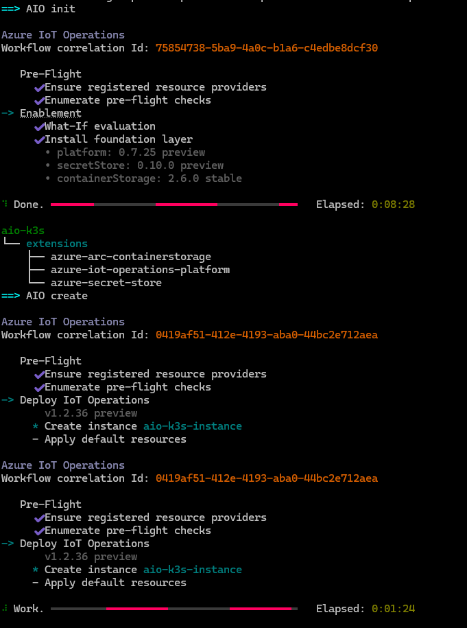

# 🚀 Azure IoT Operations Lab (Ubuntu 24.04 + K3s + Device Simulation)


Spin up an Ubuntu VM and let it **self‑provision** an end‑to‑end **Azure IoT Operations** (AIO) lab: K3s, Arc connect, AIO foundation, the **embedded quickstarts** (devices, assets, data flow), and a simulator — all from **Azure Cloud Shell** with two scripts. Tear it down with one more.

---

## ✨ What this automates

- **Arc‑enable** a K3s cluster and turn on **cluster‑connect** + **custom locations** features.  
- Deploy **Azure IoT Operations** (foundation + instance).  
- Run the two **official AIO quickstarts** end‑to‑end (this repo embeds their steps):
  - **[Deploy AIO (quickstart)](https://learn.microsoft.com/azure/iot-operations/)** 
  - **[Configure your cluster (quickstart)](https://learn.microsoft.com/azure/iot-operations/get-started-end-to-end-sample/quickstart-configure)**

> [!NOTE]
> *There is existing automated builds in the above documentation to run this in Codespaces, but the purpose of this repo is to build it out in a VM for a longer-term lab.*

---

## ⚠️ Prerequisite: Azure CLI Login

The assumption is that this deployment will be done from bash in Azure Cloud Shell. Even if you are in Cloud Shell already, it's a good idea before running the deployment script to make sure that you've logged in to Azure CLI, to set the subscription and get a refreshed token:

```bash
az login
```

---

## 🔒 Lab Security notes

- This lab uses your own Azure user credentials for all operations.
- SSH access to the VM is opened via a Network Security Group (NSG) rule.
- A local SSH key pair is generated on your local machine for authentication.

## 🧪 Quick start

```bash
git clone https://github.com/matthansen0/azure-iot-ops-lab.git
cd azure-iot-ops-lab
chmod +x deploy.sh destroy.sh
```

```bash
# Deploy the VM and copy the install script
./deploy.sh \
  --subscription "<SUB_ID>" \
  --location "eastus2" \
  --compute-rg "rg-aioCompute" \
  --ops-rg "rg-aioOps" \
  --vm-name "aio24" \
  --ssh-public-key "$HOME/.ssh/id_rsa.pub" \
  --storage-account "aio$(date +%s)" \
  --schema-registry "aioqs-sr" \
  --schema-namespace "aioqs-ns"
```

### SSH into the VM and run the install script

```bash
ssh -i ~/.ssh/id_rsa azureuser@<VM_PUBLIC_IP>
```

```bash
#Execute the script, authorized via device code.
sudo bash /usr/local/bin/aio-install.sh
```

The script will prompt you to authenticate with Azure using a device code, and will take between 30-45 minutes to complete.



### Verify (optional)

```bash
# On the VM (or via Arc)
kubectl get nodes
kubectl get pods -n azure-iot-operations
kubectl get pods -n azure-arc-containerstorage
kubectl get pods -n cert-manager

# In Azure
az iot ops list -g rg-aioOps -o table
```

> View install logs on the VM:
>
> ```bash
> tail -40 /var/log/aio-install.log
> ```

> [!TIP]
> You will be able to see finalized progress of the deployment once there is device messages being sent into the IoT Hub.

---

## 🗑️ Clean up

```bash
./destroy.sh --compute-rg "rg-aioCompute" --ops-rg "rg-aioOps"
```

---

## 🤝 Contributing

Contributions are welcome! If you have suggestions, bug reports, or improvements, please open an issue or submit a pull request. For major changes, please open an issue first to discuss what you would like to change.

Please ensure your pull request adheres to the existing style and includes relevant documentation or examples where appropriate.

---

## 📝 To-Do

- [ ] Add "next steps" automation for data ingestion and visualization
- [ ] Add support for password Azure-managed SSH key resources for VM login
- [ ] Add cost estimation or resource summary
- [ ] Create architecture diagram
