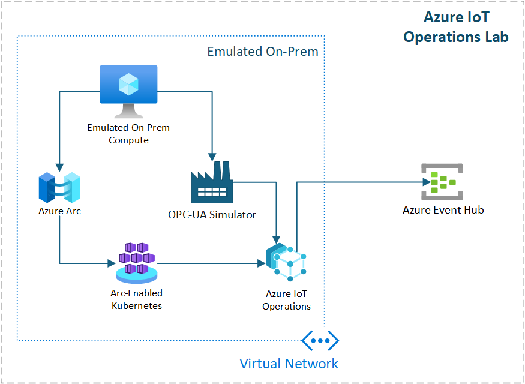
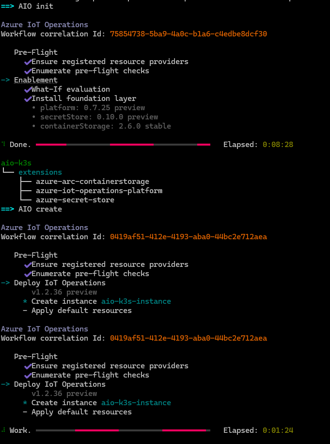

# 🚀 Azure IoT Operations Lab (Ubuntu 24.04 + K3s + Device Simulation)


Spin up an Ubuntu VM and let it **self‑provision** an end‑to‑end **Azure IoT Operations** (AIO) lab: K3s, Arc connect, AIO foundation, the **embedded quickstarts** (devices, assets, data flow), and a simulator — all from **Azure Cloud Shell** with two scripts. Tear it down with one more.

## 🖼️ Architecture Diagram



---

## ✨ What this automates

- **Arc‑enable** a K3s cluster and turn on **cluster‑connect** + **custom locations** features.  
- Deploy **Azure IoT Operations** (foundation + instance).  
- Run the two **official AIO quickstarts** end‑to‑end (this repo embeds their steps):
  - **[Deploy AIO (quickstart)](https://learn.microsoft.com/azure/iot-operations/)** 
  - **[Configure your cluster (quickstart)](https://learn.microsoft.com/azure/iot-operations/get-started-end-to-end-sample/quickstart-configure)**

> [!NOTE]
> *There is existing automated builds in the above documentation to run this in Codespaces, but the purpose of this repo is to build it out in a VM for a longer-term lab.*

---

## ⚠️ Prerequisite: Azure CLI Login

The assumption is that this deployment will be done from bash in Azure Cloud Shell. Even if you are in Cloud Shell already, it's a good idea before running the deployment script to make sure that you've logged in to Azure CLI, to set the subscription and get a refreshed token:

```bash
az login
```

---

## 🔒 Lab Security notes

- This lab uses your own Azure user credentials for all operations.
- SSH access to the VM is opened via a Network Security Group (NSG) rule.
- A local SSH key pair is generated on your local machine for authentication.

## 🧪 Quick start

```bash
git clone https://github.com/matthansen0/azure-iot-ops-lab.git
cd azure-iot-ops-lab
chmod +x *.sh
```

*Deploy the VM and copy the install script*

```bash
./deploy.sh \
  --subscription "<SUB_ID>" \
  --location "eastus2" \
  --compute-rg "rg-aioCompute" \
  --ops-rg "rg-aioOps" \
  --vm-name "aio24" \
  --ssh-public-key "$HOME/.ssh/id_rsa.pub" \
  --storage-account "aio$(date +%s)" \
  --schema-registry "aioqs-sr" \
  --schema-namespace "aioqs-ns"
```

### With Fabric RTI Integration (Optional)

To enable automatic creation of Microsoft Fabric Real-Time Intelligence resources for data visualization:

#### Step 1: Run Pre-Flight Checks (IMPORTANT!)

Before deploying with Fabric, run the pre-flight check to verify you have access and find your capacity ID:

```bash
# Make scripts executable
chmod +x fabric/*.sh

# Run pre-flight checks
./fabric/fabric-preflight.sh
```

This will:
- ✅ Verify Azure CLI login
- ✅ Test Fabric API token acquisition  
- ✅ List available Fabric capacities (you'll need one!)
- ✅ Verify workspace creation permissions

#### Step 2: Deploy with Fabric

```bash
./deploy.sh \
  --subscription "<SUB_ID>" \
  --location "eastus2" \
  --compute-rg "rg-aioCompute" \
  --ops-rg "rg-aioOps" \
  --vm-name "aio24" \
  --ssh-public-key "$HOME/.ssh/id_rsa.pub" \
  --storage-account "aio$(date +%s)" \
  --schema-registry "aioqs-sr" \
  --schema-namespace "aioqs-ns" \
  --enable-fabric \
  --fabric-workspace "aio-fabric-workspace" \
  --fabric-capacity-id "<CAPACITY_ID_FROM_PREFLIGHT>"
```

This will create:
- A Fabric workspace (on your specified capacity)
- An Eventhouse for real-time analytics
- A KQL database for storing oven telemetry
- An Eventstream for data ingestion

> [!IMPORTANT]
> The `--fabric-capacity-id` is **required**. Get it from the pre-flight check output above.

> [!NOTE]
> Fabric integration requires appropriate Fabric capacity and permissions. See [Fabric RTI Integration](#-fabric-rti-integration) for details.

### SSH into the VM and run the install script

```bash
ssh -i ~/.ssh/id_rsa azureuser@<VM_PUBLIC_IP>
```

```bash
sudo bash /usr/local/bin/aio-install.sh
```

The script will prompt you to authenticate with Azure using a device code, and will take between 30-45 minutes to complete.



### Verify (optional)

```bash
# On the VM (or via Arc)
kubectl get nodes
kubectl get pods -n azure-iot-operations
kubectl get pods -n azure-arc-containerstorage
kubectl get pods -n cert-manager

# In Azure
az iot ops list -g rg-aioOps -o table
```

> View install logs on the VM:
>
> ```bash
> tail -40 /var/log/aio-install.log
> ```

> [!TIP]
> You will be able to see finalized progress of the deployment once there is device messages being sent into the IoT Hub.

---

## 🗑️ Clean up

```bash
./destroy.sh --compute-rg "rg-aioCompute" --ops-rg "rg-aioOps"
```

---

## 🤝 Contributing

Contributions are welcome! If you have suggestions, bug reports, or improvements, please open an issue or submit a pull request. For major changes, please open an issue first to discuss what you would like to change.

Please ensure your pull request adheres to the existing style and includes relevant documentation or examples where appropriate.

---

## 📝 To-Do

- [x] Add "next steps" automation for data ingestion and visualization (Fabric RTI)
- [ ] Add support for password Azure-managed SSH key resources for VM login
- [ ] Add cost estimation or resource summary
- [x] Create architecture diagram

---

## 📊 Fabric RTI Integration

This lab supports integration with Microsoft Fabric Real-Time Intelligence (RTI) for data visualization and analytics.

### What's Automated vs Manual

| Step | Automated? | Notes |
|------|------------|-------|
| Pre-flight checks | ✅ Yes | `./fabric/fabric-preflight.sh` |
| Fabric Workspace creation | ✅ Yes | Via Fabric REST API |
| Eventhouse creation | ✅ Yes | Via Fabric REST API |
| KQL Database creation | ✅ Yes | Via Fabric REST API |
| Eventstream creation | ✅ Yes | Via Fabric REST API |
| Eventstream Custom App source | ⚠️ **Manual** | Fabric portal required |
| Eventstream → KQL destination | ⚠️ **Manual** | Fabric portal required |
| KQL table schema | ⚠️ **Script provided** | Run KQL command |
| AIO Dataflow configuration | ✅ Yes | After getting connection string |

> [!WARNING]
> **The Fabric REST API has limitations.** Eventstream source/destination configuration currently requires the Fabric portal. We automate everything possible and provide scripts for the rest.

### Prerequisites for Fabric

1. **Fabric Capacity**: You need access to a Fabric capacity (F2 or higher, or trial)
2. **Permissions**: Your Azure AD account must have permission to create Fabric workspaces
3. **Fabric Enabled**: Fabric must be enabled for your tenant

Run the pre-flight check to verify all prerequisites:
```bash
./fabric/fabric-preflight.sh
```

### Data Flow Architecture

```
┌─────────────────┐     ┌─────────────────┐     ┌─────────────────┐
│   OPC PLC       │────▶│   AIO Broker    │────▶│   AIO Dataflow  │
│   Simulator     │     │   (MQTT)        │     │   (Transform)   │
│   (thermostat)  │     │                 │     │                 │
└─────────────────┘     └─────────────────┘     └────────┬────────┘
                                                         │
                                                    Event Hub
                                                    Protocol
                                                         │
                                                         ▼
┌─────────────────┐     ┌─────────────────┐     ┌─────────────────┐
│   KQL Database  │◀────│   Eventhouse    │◀────│   Eventstream   │
│   (Query/View)  │     │   (Storage)     │     │   (Custom App)  │
└─────────────────┘     └─────────────────┘     └─────────────────┘
         │                                              ▲
         │              MANUAL SETUP REQUIRED           │
         └──────────────────────────────────────────────┘
```

### Complete Setup Process

#### Phase 1: Pre-Flight (Before AIO Deploy)

```bash
# 1. Verify Fabric access and get capacity ID
./fabric/fabric-preflight.sh

# 2. Note your capacity ID from the output
```

#### Phase 2: Deploy AIO with Fabric Resources

```bash
./deploy.sh \
  --subscription "<SUB_ID>" \
  --location "eastus2" \
  --storage-account "aio$(date +%s)" \
  --enable-fabric \
  --fabric-workspace "aio-fabric-workspace" \
  --fabric-capacity-id "<YOUR_CAPACITY_ID>"
```

This creates the Fabric workspace, Eventhouse, KQL Database, and Eventstream.

#### Phase 3: Manual Fabric Portal Configuration

After deployment, complete these steps in the [Fabric portal](https://app.fabric.microsoft.com):

1. **Open your Eventstream**
2. **Add Custom App source:**
   - Click "New source" → "Custom App"
   - Name it `aio-input`
   - Copy the **Event Hub connection string**
3. **Add KQL Database destination:**
   - Click "New destination" → "KQL Database"
   - Select your Eventhouse and database
   - Configure data mapping (or use "Direct ingestion")
4. **Activate the Eventstream**

#### Phase 4: Configure AIO Dataflow

On the AIO VM, configure the dataflow with your connection string:

```bash
# SSH into VM
ssh -i ~/.ssh/id_rsa azureuser@<VM_PUBLIC_IP>

# Run the setup wizard (provides KQL table schema and instructions)
sudo /usr/local/bin/fabric-eventstream-setup.sh wizard

# Step 1: Generate the DataflowEndpoint YAML
# Replace with your Eventstream's Event Hub namespace from Fabric portal
sudo /usr/local/bin/fabric-dataflow.sh generate-endpoint \
  "your-workspace-eventstream.servicebus.windows.net" > /tmp/endpoint.yaml

# Review and apply the endpoint
cat /tmp/endpoint.yaml
kubectl apply -f /tmp/endpoint.yaml

# Step 2: Generate the Dataflow YAML
# First arg = endpoint name (from endpoint.yaml metadata.name)
# Second arg = topic/destination name (typically "destinationeh" or your Event Hub name)
sudo /usr/local/bin/fabric-dataflow.sh generate-dataflow \
  fabric-eventstream-endpoint \
  destinationeh > /tmp/dataflow.yaml

# Review and apply the dataflow
cat /tmp/dataflow.yaml
kubectl apply -f /tmp/dataflow.yaml

# Verify deployment
kubectl get dataflow -n azure-iot-operations
kubectl get dataflowendpoint -n azure-iot-operations
```

### Validating the Integration

```bash
# Quick connectivity test (no resources created)
./fabric/fabric-api.sh test

# Full integration test (creates and deletes test resources)
./fabric/test-fabric-integration.sh all

# Check Eventstream is receiving data (in Fabric portal)
# Query KQL database:
```

### Querying Oven Data in Fabric

Once data is flowing, query it in a KQL Queryset:

```kql
// Get recent telemetry (extract values from dynamic columns)
OvenTelemetry
| extend TempValue = toreal(Temperature.Value),
         WeightValue = toreal(Weight.Value),
         EnergyValue = toreal(EnergyUse.Value)
| where Timestamp > ago(1h)
| project Timestamp, TempValue, WeightValue, EnergyValue, AssetId
| order by Timestamp desc
| take 100

// Analyze temperature trends
OvenTelemetry
| extend TempValue = toreal(Temperature.Value)
| where Timestamp > ago(24h)
| summarize avg_temp = avg(TempValue), 
            max_temp = max(TempValue),
            min_temp = min(TempValue)
  by bin(Timestamp, 1h)
| render timechart
```
